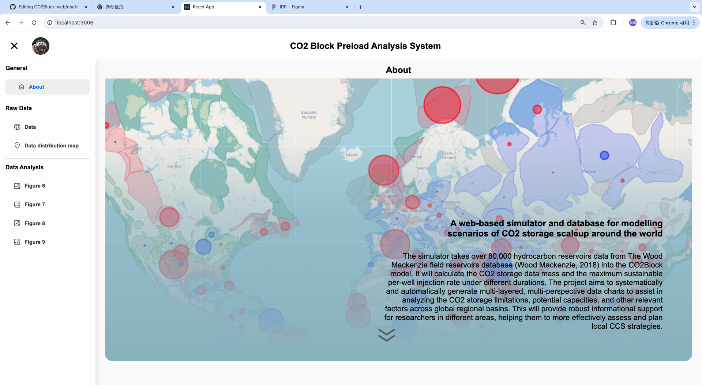
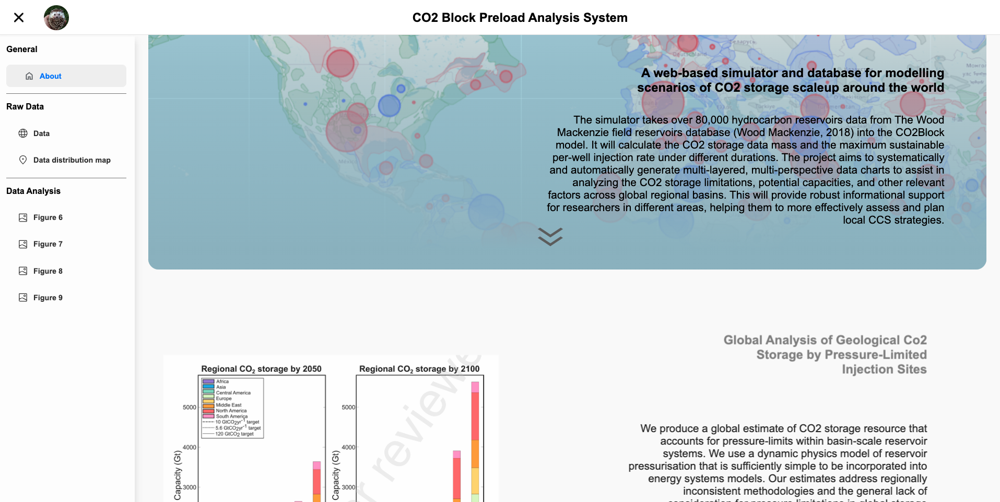
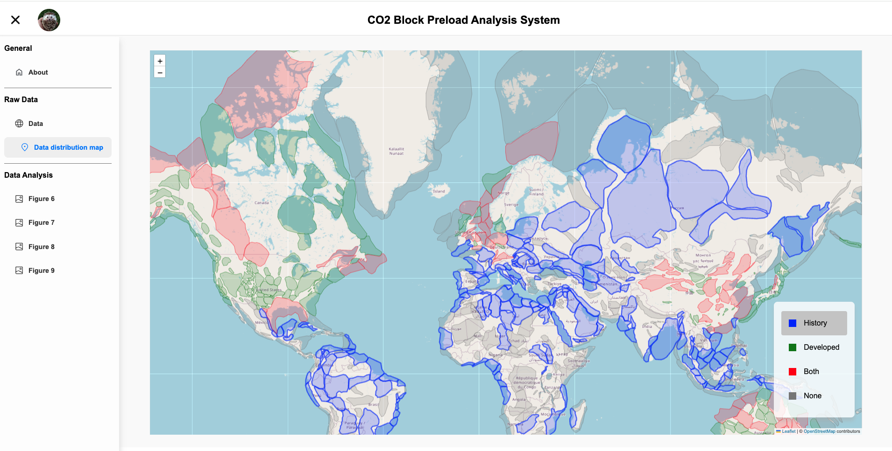
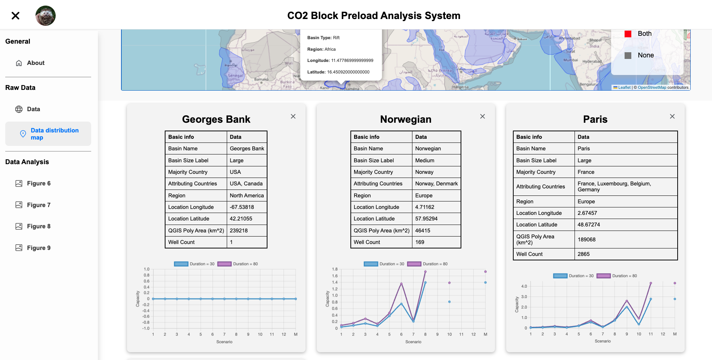
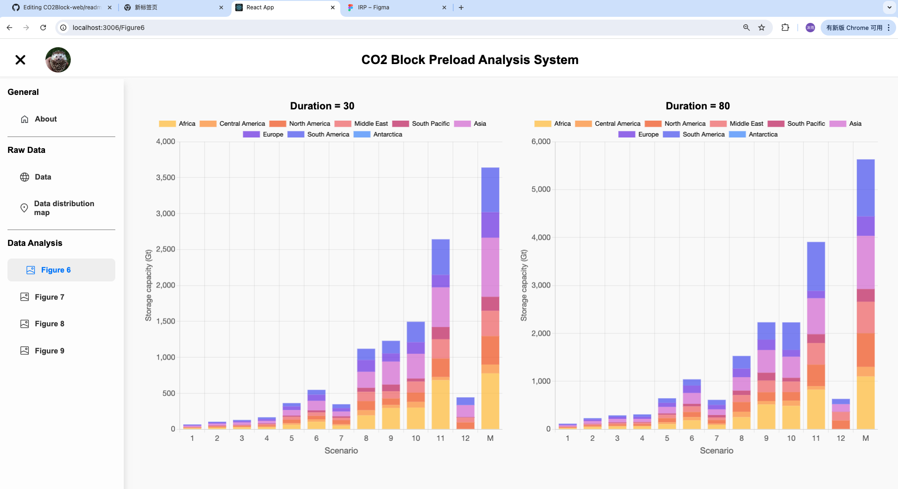
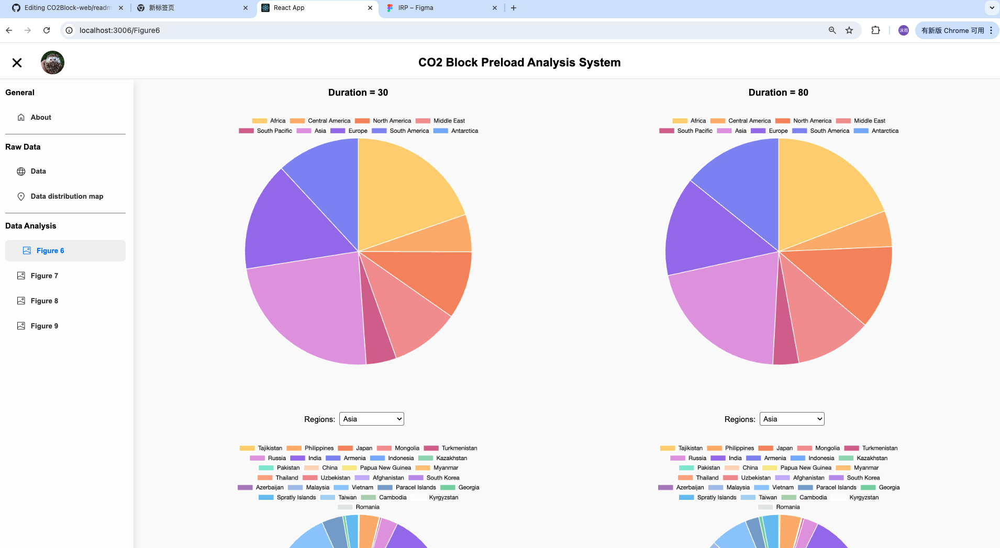
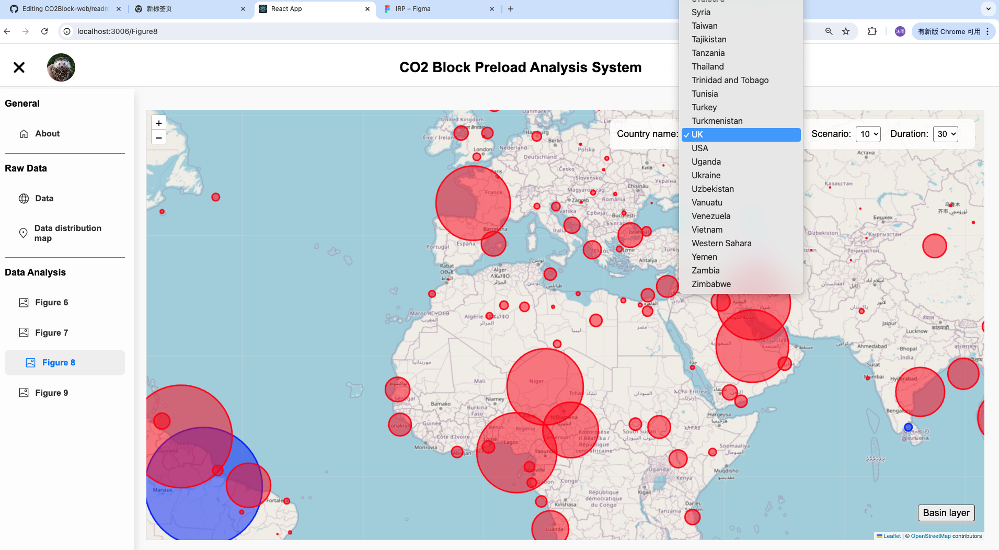
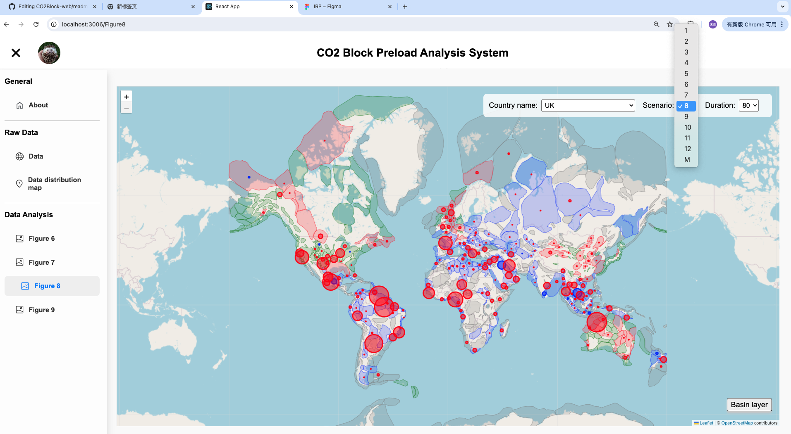

# CO2Block: CO2 Capture and Storage Data Analysis Platform

## Overview
CO2Block is a sophisticated web-based simulator that utilizes the CO2Block model to analyze CO2 storage scalability globally. The platform is built with React, employing HTML and CSS for the front-end, and Node.js for back-end integration, enabling real-time data processing and a dynamic user experience.

### Technologies
- **Front-end:** React, HTML, CSS, Chart.js, leaflet, GSAP, Figma
- **Back-end:** Node.js

## prototype
link: https://www.figma.com/proto/RVsZLQby6bOhi8ZniW7PbA/IRP?node-id=0-1&t=SUQge6J1XmcAdKpI-1

## Interfaces
The application features three main parts with seven distinct interfaces, each offering different perspectives on the data calculated by the CO2Block model. Here are the four examples.

### Interface 1: About
The default web page that provides a comprehensive overview of the CO2Block model, including:
- Introduction to the model
- Analyses of different CO2 storage scenarios worldwide
- Links to relevant academic papers

**Images:**
  
 

### Interface 2: Data Distribution Map
This interface offers a visual representation of recorded basins globally with features like:
- Highlighting on hover
- Detailed geological information on double-click (including the country, coordinates, area, and number of wells)
- Storage capacity under 13 scenarios across two time spans

**Images:**
- 
- 

### Interface 3: Regional Analysis
Provides forecasts of CO2 storage contributions by different global regions through:
- Bar charts for clear visualization of storage by scenario
- Pie charts for comparing the contribution of each region within a scenario

**Images:**
- 
- 

### Interface 4: Global CO2 Storage Map
Visualizes CO2 storage capacity in basins worldwide with features like:
- Interactive maps showing storage capacity under different scenarios
- Color-coded markers indicating limiting factors (pressure or number of injection sites)
- Filters for viewing data by country or scenario

**Images:**
- 
- 
